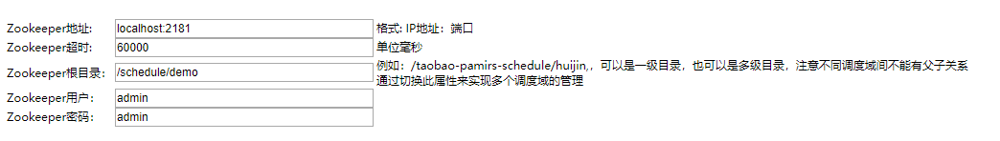
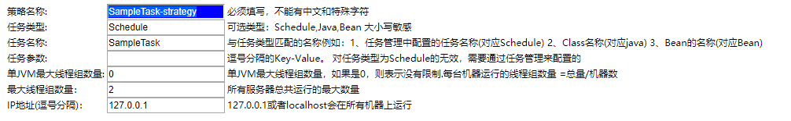
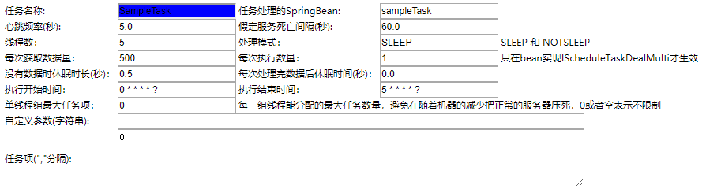

[](https://travis-ci.org/nmyphp/tbschedule)
[](https://github.com/nmyphp/tbschedule/releases)
[](https://996.icu)
[](https://www.apache.org/licenses/LICENSE-2.0.html)


tbschedule是一个支持分布式的调度框架，让批量任务或者不断变化的任务能够被动态的分配到多个主机的JVM中，
在不同的线程组中并行执行，所有的任务能够被不重复，不遗漏的快速处理。基于ZooKeeper的纯Java实现，由Alibaba开源。
> 代码来自http://code.taobao.org/p/tbschedule/src/

### 快速开始

#### 1. 获取代码，并在本地打包
```shell
clone https://github.com/nmyphp/tbschedule.git

cd tbschedule

mvn package
```
打包之后，在tbschedule-core和tbschedule-console下面会分别生成：

>tbschedule-core\target\tbschedule-core-3.4.0.jar
>
>tbschedule-console\target\tbschedule-console-3.4.0.war

将tbschedule-core发布到你的私服：
```
mvn deploy
```

#### 2. 依赖核心jar包，开发业务代码
在工程中添加如下依赖：
```
<dependency>
    <groupId>com.taobao.pamirs.schedule</groupId>
    <artifactId>tbschedule-core</artifactId>
    <version>3.4.0</version>
</dependency>
```

根据业务需要选择以下两种接口实现你的业务代码：

如果每次只处理一个任务，实现IScheduleTaskDealSingle接口：
```java
/**
 * 简单任务示例
 */
@Slf4j
public class SampleTask implements IScheduleTaskDealSingle<User> {

    @Autowired
    private UserService userService;

    @Override
    public boolean execute(User task, String ownSign) {
        try {
            log.info("开始处理用户：{}", task);
            task.setAge(task.getAge() + 1);
            userService.update(task);
            return true;
        } catch (Exception e) {
            log.error("处理失败：user:{}", task);
            return false;
        }
    }

    @Override
    public List<User> selectTasks(String taskParameter, String ownSign, int taskItemNum,
        List<TaskItemDefine> taskItemList, int eachFetchDataNum) {

        List<User> users = userService.getUsers(taskItemNum, taskItemList, eachFetchDataNum);
        log.info("获取到{}条待处理的用户", users.size());
        return users;
    }

    @Override
    public Comparator<User> getComparator() {
        // 可不实现
        return null;
    }
}
```
如果需要批处理，实现IScheduleTaskDealMulti接口，详细请参考SampleMutiTask。

#### 3. 配置调度
tbschedule需要依赖Zookeeper做分布式调度，所以需要在配置中指定zk的地址，作业根路径等信息。
```xml
<?xml version="1.0" encoding="GBK"?>
<!DOCTYPE beans PUBLIC "-//SPRING//DTD BEAN//EN" "http://www.springframework.org/dtd/spring-beans.dtd">
<beans default-autowire="byName">
    <bean id="sampleTask" class="com.free.tbschedule.demo.task.SampleTask"/>
    <bean id="scheduleManagerFactory" class="com.taobao.pamirs.schedule.strategy.TBScheduleManagerFactory"
        init-method="init">
        <property name="zkConfig">
            <map>
                <entry key="zkConnectString" value="localhost:2181"/>
                <entry key="rootPath" value="/schedule/demo"/>
                <entry key="zkSessionTimeout" value="60000"/>
                <entry key="userName" value="admin"/>
                <entry key="password" value="admin"/>
                <entry key="isCheckParentPath" value="true"/>
            </map>
        </property>
    </bean>
</beans>
```
上面配置zk地址为localhost:2181，需要启动一个端口为2181的zk。

然后再启动时加载上面的配置到spring上下文，也可以直接作为上下文启动，比如：
```java
public class Main {

    public static void main(String[] args) {
        FileSystemXmlApplicationContext context = new FileSystemXmlApplicationContext("classpath:schedule.xml");
        context.start();
        System.out.println("Tbschedule is started!");
    }
}
```
#### 4. 部署tbschedule管理后台，配置作业调度信息
将上面打包得到的tbschedule-console-3.4.0.war部署到tomcat容器中，比如tomcat端口为8080，访问：
```html
http://localhost:8080/schedule/index.jsp?manager=true
```
- ZK连接配置



这里的配置只要和第3步保持一致就可以了，然后依次点击：保存-管理主页，将进入tbshedule的调度配置页面。

- 调度策略



*策略名称*可以自定义，比如SampleTask-strategy。*任务名称*可以自定义，但需要和[任务管理]页面的保持一致。

- 任务管理



*任务名称*可以自定义，但需要和[调度策略]页面的保持一致。任务处理的SpringBean需要和schedule.xml中的beanName保持一致。

至此，一个基于tbschedule的调度任务创建完成，请开始你的体验之旅吧！

### 了解更多
- [tbschedule主要概念](./doc/tbschedule.md)
- [tbschedule运行图解](./doc/tbscheduleLogic.md)
- [多机部署](./doc/多机部署.md)
- [调度策略和任务的关系](./doc/调度策略和任务的关系.md)
- 欢迎加入QQ群讨论


